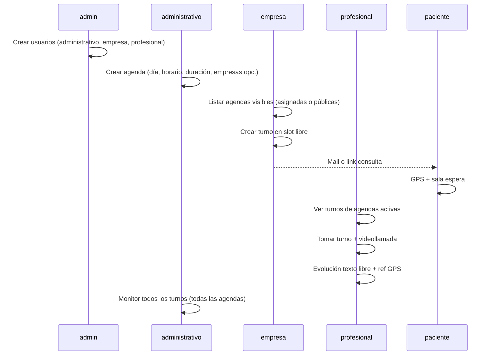

# Design: Roles y Agendas v2

## Decisiones de arquitectura

### D1 — Cinco actores, cuatro roles con login

- `paciente` no es fila en `Usuario`; acceso por JWT en URL (sin cambio).
- `ROLES` pasa a: `admin | administrativo | empresa | profesional`.

### D2 — Agenda = día + horario + duración fija

Una **Agenda** representa la disponibilidad de **un día concreto**:

| Campo | Tipo | Notas |
|-------|------|-------|
| `fecha` | Date (solo día) | Día calendario de la agenda |
| `horaInicio` | string `HH:mm` | Inicio del bloque |
| `horaFin` | string `HH:mm` | Fin del bloque |
| `duracionTurnoMinutos` | number | Duración **única** de cada slot; ej. 15 → slots 09:00, 09:15, 09:30… |
| `empresaIds` | ObjectId[] | **Opcional**. Vacío = cualquier empresa activa puede agendar |
| `nombre` | string | Opcional (ej. "Guardia matutina") |
| `descripcion` | string | Opcional |
| `creadoPorId` | ObjectId → Usuario | Auditoría; rol administrativo |
| `activa` | boolean | |

**Slots**: se calculan en runtime (no se persisten): desde `horaInicio` hasta `horaFin` en pasos de `duracionTurnoMinutos`. Un turno ocupa exactamente un slot.

**Visibilidad empresa**: al listar agendas, la empresa ve las que cumplen `(empresaIds vacío OR su empresaId ∈ empresaIds) AND activa AND fecha >= hoy`.

Un **Turno** DEBE tener `agendaId` además de `empresaId` y `pacienteId`. La `fechaHoraProgramada` debe coincidir con un slot válido de esa agenda.

### D3 — Varios administrativos, vista compartida

- Puede haber **N usuarios** con rol `administrativo`.
- Todos tienen el **mismo perfil de permisos** (MVP: sin flags por usuario).
- Cualquier administrativo puede crear agendas; **todos** ven **todas** las agendas y turnos (equipo de coordinación compartido).
- `creadoPorId` queda para auditoría, no restringe visibilidad.

### D4 — Separación admin vs administrativo

| | admin | administrativo |
|---|-------|----------------|
| Usuarios y roles | ✅ | ❌ |
| Crear usuario administrativo | ✅ (asigna rol, sin extras) | ❌ |
| Crear agendas | ❌ | ✅ |
| Supervisar turnos en agendas | ❌ | ✅ cross-tenant, todas las agendas |

### D5 — Empresa acotada a tenant + agenda

- Listado de turnos: `empresaId = sesión` (sin cambio de aislamiento).
- Alta de turno: elegir **agenda visible** (asignada o pública) + **slot libre** dentro de esa agenda.
- Sin acceso a agendas restringidas a otras empresas ni creación de agendas.

### D6 — Profesional y evolución

Al cerrar o durante consulta `en_curso`, el profesional registra **evolución** (texto libre):

```typescript
evolucion: {
  texto: string;              // obligatorio al finalizar
  registradoEn: Date;
  gpsRegistroId?: ObjectId;  // último RegistroGPS del turno al guardar
}
```

El panel de consulta muestra mapa/sello GPS y la evolución queda en auditoría.

### D7 — Migración desde MVP

- Script `migrate-franjas-to-agendas.ts`: por cada franja activa, crear agenda(s) con fecha futura o agenda default + backfill `agendaId`.
- Deprecar `FranjaHoraria` tras migración.

## Diagrama de flujo (alto nivel)



## Rutas y APIs (borrador)

### administrativo

- `GET/POST /api/administrativo/agendas`
- `PATCH /api/administrativo/agendas/[id]`
- `GET /api/administrativo/turnos` — todos los turnos (filtros agenda, estado, fecha)
- `GET /api/administrativo/agendas/[id]/slots` — slots libres/ocupados (opcional, UX)

### empresa

- `GET /api/empresa/agendas` — públicas + asignadas a su tenant, activas
- `GET /api/empresa/agendas/[id]/slots` — slots disponibles
- `POST /api/empresa/turnos` — requiere `agendaId` + slot válido

### profesional

- `GET /api/profesional/turnos` — turnos de agendas activas
- `PATCH /api/profesional/turnos/[id]/evolucion` — guardar evolución + gpsRegistroId

### admin

- Mantener `/api/admin/usuarios`, `/api/admin/empresas`
- Quitar o redirigir `/api/admin/franjas` → deprecado

## AuthZ

```typescript
ROLES = ["admin", "administrativo", "empresa", "profesional"] as const;

/admin/**           → admin
/administrativo/**  → administrativo
/empresa/**         → empresa
/profesional/**     → profesional
/consulta/**        → público (token)
```

## Alternativas descartadas

| Alternativa | Por qué no |
|-------------|------------|
| Renombrar `empresa` a `administrativo` | Actores distintos en el negocio |
| Admin sigue creando franjas | Operación la lleva administrativo |
| Agenda recurrente semanal (franja) | Usuario pidió agenda **por día** |
| Agenda sin empresas = nadie puede agendar | Usuario pidió: vacío = **cualquier empresa** |
| Permisos distintos por administrativo (MVP) | Complejidad innecesaria; admin solo asigna rol |
| Slots persistidos en BD | Se derivan de horario + duración |

## Testing strategy

- Unit: generación de slots y validación turno en slot libre
- Unit: empresa agenda en agenda pública vs restringida
- Unit: empresa no agenda en agenda ajena (empresaIds sin su id)
- Integration: administrativo ve turnos cross-tenant
- Integration: evolución guarda referencia a RegistroGPS
- E2E (fase posterior): flujo completo por rol
