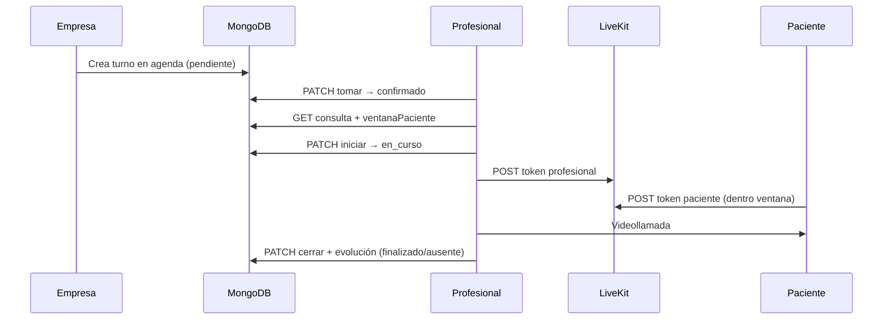

# Design: profesional-consulta-flow

## Arquitectura del flujo

## Decisiones técnicas

| # | Decisión | Rationale |
|---|----------|-----------|
| D1 | Filtro “solo hoy” con `getAgendaDayRange` + `getAgendaDayKey` | Alineado a `docs/conventions.md` (Argentina) |
| D2 | `getPatientLinkWindow()` compartido | Misma lógica que `resolvePatientConsulta`, expuesta al profesional |
| D3 | Evolución obligatoria en `finalizado` y `ausente` | Acordado en proposal; validación Zod + service |
| D4 | Profesional puede iniciar antes de ventana paciente | UI informa; no bloqueamos `iniciar` |
| D5 | Smoke WebRTC manual en VPS | Patrón bootstrap; no E2E video en CI |

## Cambios por capa

### Backend

- `src/lib/turnos/patient-window.ts` — estado ventana link paciente
- `src/lib/turnos/profesional-service.ts` — timezone hoy AR; evolución ausente; meta consulta
- `src/app/api/profesional/turnos/[id]/route.ts` — `ventanaPaciente` en GET
- `src/lib/validations/profesional.ts` — Zod evolución ausente

### Frontend

- `src/components/profesional/consulta-panel.tsx` — banner ventana paciente; evolución ausente

### Docs

- `docs/smoke-profesional-consulta.md` — checklist VPS
- `docs/deploy.md` — enlace al smoke

## Sin cambios

- Modelo asignación (pool / tomar turno)
- Ventana token paciente (`TOKEN_VALID_*`)
- Infra LiveKit compose (salvo verificación en smoke)

## Riesgos residuales

- WebRTC depende de UDP/DNS en VPS — mitigado con smoke doc
- Profesional en sala sin paciente — UX “esperando paciente” en `VideoCallShell`
